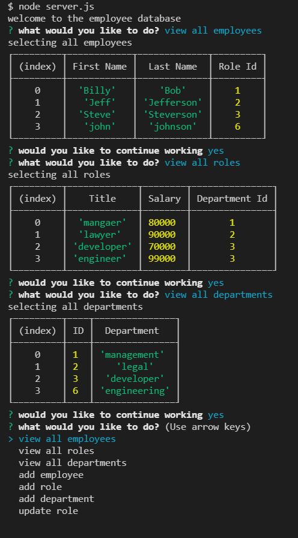

# Employee-Management

## Description

We were tasked with creating a command line employee management app. The app allows employers to quickly see their employees, which department they work in, and what their role is. The app also allows the employers to modify their employees roles.

#Usage
To use the tool type node index.js into your terminal.

#License
MIT .

#Screenshot

